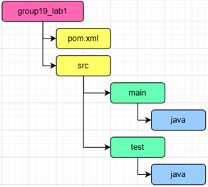
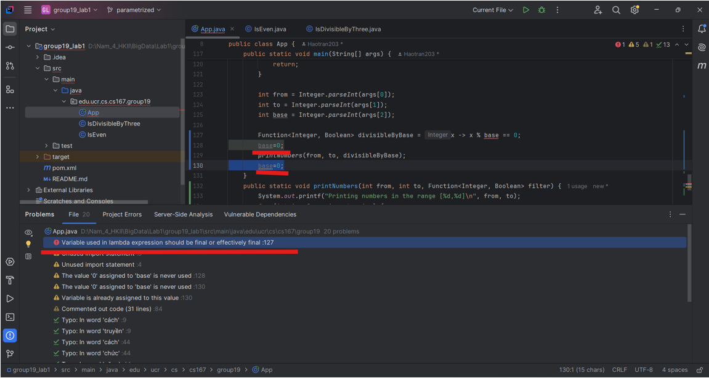

# Lab 1 - Development Setup and Functional Programming in Java

## Members: 
Trần Quang Hào - 21IT546  
Hồ Văn Thành Đạt - 21IT265  
Trầ Công Hoàng Triều - 21IT657

## Answers question on lab 1

### Q1. Tên của thư mục mvn archectype:generate được lệnh này tạo ra là gì?
- Maven sẽ tạo ra một thư mục dự án có tên chính là giá trị của DartifactId, tức là: group19_lab1  
- Thư mục này sẽ được tạo ra bên trong thư mục lab1 với cấu trúc như sau:  

### Q2. Bạn thấy gì ở đầu ra của bảng điều khiển khi chạy lệnh java?
- Khi chạy lệnh trên ta sẽ thấy dòng đầu ra: Hello World!  
- Đây là đầu ra mặc định từ phương thức main trong lớp App.java được tạo bởi archetype maven-archetype-quickstart.

### Q3. Cách nào sau đây là đúng để gọi hàm IsEvent?  
A. IsEvent(5)  
B. IsEvent.apply(5)  
C. new IsEvent().apply(5)  
- Đáp án đúng là C, vì IsEvent là một class và ta cần khởi tạo đối tượng bằng new, apply(5) là hàm để kiểm tra số chẵn.
- Lưu ý: Vì Java là ngôn ngữ lập trình hướng đối tượng, mọi thứ phải là đối tượng bao gồm cả hàm. Đó là lý do tại sao ta định nghĩa hàm bằng cách định nghĩa một lớp m sau đó chúng ta có thể khởi tạo thành một đối tượng.  

### Q4. Liệu chương trình có biên dịch sau khi bạn thêm dòng base=0 không?
- Chương trình sẽ không biên dịch nếu bạn thêm dòng base=0; vaào cuối main.  
- Vì trong java, các biến sử dụng trong biểu thức lambda phải là final hoặc effectively final (tức là không thay đổi giá trị sau khi được khởi tạo). Khi bạn gán lại giá trị cho base sau khi đã dùng nó trong lambda expressions, điều này vi phạm nguyên tắc này.  

### Q5. Nếu câu trả lời của bạn cho câu hỏi 4 là Không, thông báo lỗi nhận được là gì?

- Thông báo lỗi: Variable used in lambda expression should be final or effectively final.  
- Có nghĩa là: base phải là final hoặc effectively final để có thể sử dụng trong lambda expression. Khi gán lại giá trị cho base, nó không còn được gọi là final, vì vậy lỗi sẽ xuất hiện.  

---

## Additional Notes

- Make sure Java 8 and Maven are installed.
- Test run commands are included in `run.sh`.